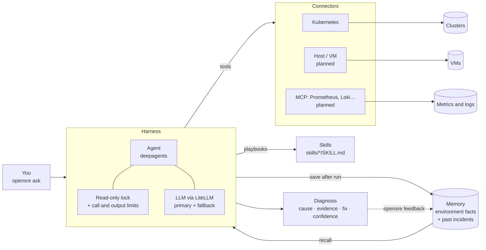

# OpenSre

OpenSre is a read-only SRE agent for the command line. Ask it why something is broken. It inspects your infrastructure through connectors, follows markdown playbooks, and answers with the cause, the evidence and a suggested fix. It never changes your targets.

Example investigation:

```console
$ opensre ask "why is the checkout service down?"
Summary                  checkout pods are crash-looping
Cause                    DATABASE_URL is missing from the deployment environment
Evidence (kubernetes)    pod/checkout-7c9f: CrashLoopBackOff, 14 restarts
Evidence (kubernetes)    previous container log: "KeyError: DATABASE_URL"
Suggested fix            add DATABASE_URL to deployment/checkout from secret db-credentials
Confidence               86%
```

> **Status: early development.** Working today: investigations, scans, environment facts and incident memory; Kubernetes provides 10 read-only tools and 7 quick checks.

## How it works



1. **Connectors** are plug-ins, one per kind of target. Each provides a health check (used by `doctor`), read-only tools for the agent, and quick rule checks (used by `scan`).
2. **Skills** are markdown playbooks, such as "how to investigate a crash loop". The agent reads the relevant one while investigating.
3. **The agent** plans, calls connector tools, reads skills, and returns a typed `Diagnosis`.
4. **Memory** loads human-edited environment facts and recalls up to three same-target incidents, with their age. Right diagnoses are similar past incidents; wrong ones are previously ruled out. The harness saves successful investigations as unconfirmed until your feedback. The agent never writes memory.
5. **The lock** keeps the agent read-only:
   - Writes are denied, and the write, edit and execute tools are removed.
   - Before every run, OpenSre checks the exact tools the model receives and refuses to start if any could change something.
   - Each run has hard limits on model calls, tool calls and tool output size.

## Quickstart

Requires Python 3.12+, [uv](https://docs.astral.sh/uv/) and a kubeconfig.

```bash
git clone https://github.com/DevloperAmanSingh/sre-agent.git && cd sre-agent
uv sync
export DEEPSEEK_API_KEY=...        # primary model
export OPENAI_API_KEY=...          # fallback model (optional)
uv run opensre doctor              # check cluster access and model keys
uv run opensre ask "what namespaces exist?"
```

## Commands

| Command | What it does |
|---|---|
| `opensre doctor` | Checks each connector's health and the model keys. `--live` sends one tiny prompt per model. `--json` for scripts. |
| `opensre tools` | Lists every tool the agent can use and where it comes from, after the read-only lock. |
| `opensre ask "<question>"` | Investigates and saves a diagnosis. `--json` includes `incident_id`; `--no-memory` skips incident recall and save. |
| `opensre scan` | Runs enabled connectors' quick checks without AI. `-n/--namespace` overrides the namespace; `--json` for scripts. |
| `opensre remember "<fact>"` | Appends a redacted, single-line environment fact. |
| `opensre feedback <id> --right\|--wrong [--note "..."]` | Marks a saved diagnosis; choose exactly one verdict. |
| `opensre memory list [--limit N] [--json]` | Lists recent incidents, including unconfirmed ones. |
| `opensre memory prune --older-than 90d` | Deletes incidents older than the given age. |

Exit codes: `0` ok, `1` an operation failed (including unknown incident IDs), `2` invalid configuration or arguments.

## Configuration

Copy [`examples/opensre.yaml`](examples/opensre.yaml) to `./opensre.yaml`:

```yaml
connectors:
  kubernetes:
    enabled: true
    context: null          # kubeconfig context, null = current
    namespace: default
    request_timeout_s: 10
memory:
  enabled: true
  dir: ~/.opensre
llm:
  primary: deepseek/deepseek-chat
  fallback: openai/gpt-5.6-luna   # null disables fallback
  timeout_s: 60
```

- **Precedence:** CLI flags, then `OPENSRE_*` env vars (nested with `__`, e.g. `OPENSRE_LLM__PRIMARY`), then the YAML file, then defaults.
- **API keys** come from environment variables only, never the YAML.
- **Memory:** `memory.dir` (or `OPENSRE_MEMORY__DIR`) holds `memory.db` and `memory/environment.md`; optional `./.opensre/memory.md` adds project facts. `memory.enabled: false` disables loading, recall and saving during investigations. Memory errors warn without failing a diagnosis; Kubernetes history requires a resolvable context.
- **Models:** any [LiteLLM](https://docs.litellm.ai/docs/providers) model name works.
